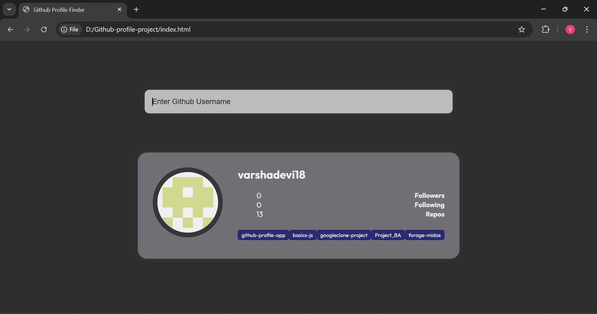
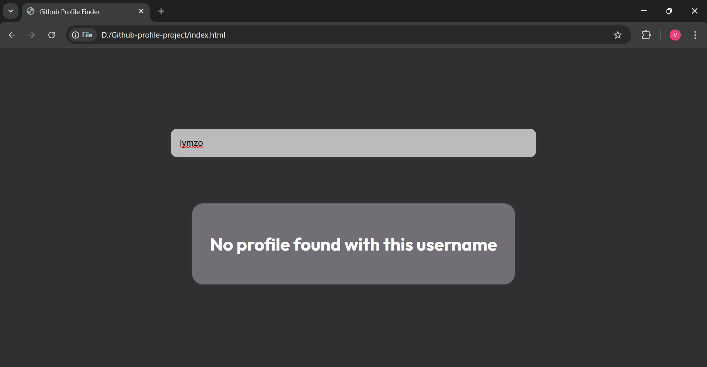

  <h1>GitHub Profile Finder</h1>

<h2>Working</h2>
<ol>
  <li>User enters a GitHub username.</li>
  <li>JavaScript listens for the Enter key.</li>
  <li>Axios sends API requests.</li>
  <li>If user exists → profile card is updated.</li>
  <li>If user doesn’t exist → error message appears.</li>
</ol>

<h2>Preview</h2>

<em>The project UI looks like this:</em>

  

<h2>Live coding</h2>
  <ul>
  <li><a href="assets/screen-recordings/live coding1.mp4">Live Coding-1</a></li>
  <li><a href="assets/screen-recordings/live coding2.mp4">Live Coding-2 </a></li>
  <li><a href="assets/screen-recordings/live coding3.mp4">Live Coding-3 </a></li>
  <li><a href="assets/screen-recordings/final-demo.mp4">Full Demo </a></li>
</ul>

<h2>Tech Stack used</h2>
<ul>
  <li><strong>HTML</strong> – Structure</li>
  <li><strong>CSS</strong> – Styling + Layout</li>
  <li><strong>JavaScript (ES6+)</strong> – Logic & API Handling</li>
  <li><strong>Axios CDN</strong> – For HTTP requests</li>
</ul>

<h2>GitHub API Endpoints Used</h2>
<table>
  <tr>
    <th>Purpose</th>
    <th>Endpoint</th>
  </tr>
  <tr>
    <td>Fetch user details</td>
    <td><code>https://api.github.com/users/{username}</code></td>
  </tr>
  <tr>
    <td>Fetch repos list</td>
    <td><code>https://api.github.com/users/{username}/repos</code></td>
  </tr>
</table>
